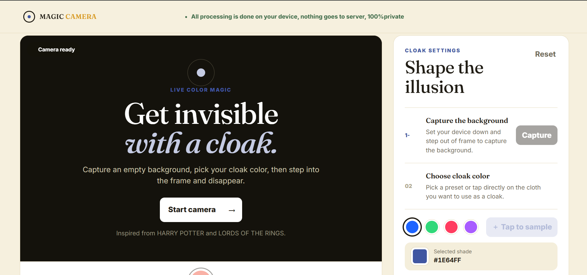

# Magic Camera — Get Invisible by Using Cloak

Magic Camera is a free browser-based invisibility-cloak experiment. It records an empty view of the scene, detects a selected cloth color in the live camera, and replaces that colored area with the saved background. The result creates the illusion that anything behind the cloth has disappeared.

**Live demo:** https://magic-camera-five.vercel.app/


<!-- Replace the path above with the actual screenshot location, e.g. dist/screenshots/home.png or docs/home.png -->

The project uses plain HTML, CSS, and JavaScript. It has no framework, account system, database, paid API, tracking service, or server-side camera processing.

## Features

- Live camera processing on phones, tablets, laptops, and desktops
- Front and rear camera switching
- Three-second background-capture countdown
- Thirty-frame background preparation
- Blue, green, red, and purple cloak presets
- Custom color sampling by tapping the cloth in the preview
- Live preview and hex value for the selected or sampled cloth shade
- Adjustable color range and edge softness
- Noise removal and mask expansion
- Live frames-per-second counter
- Fullscreen camera view
- Photo capture, download, and device sharing
- Installable progressive web app
- Offline application shell
- Camera frames remain on the device

## How the effect works

The effect follows this pipeline for every camera frame:

1. The browser requests access to the selected camera.
2. The user leaves the scene during a three-second countdown.
3. The app reads thirty frames and saves the final clean frame as the background.
4. Each new camera frame is mirrored when the front camera is active.
5. Every pixel is converted from RGB to HSV color values.
6. Pixels inside the selected hue, saturation, and brightness range become the cloak mask.
7. A 3×3 erosion pass removes small isolated pixels.
8. A 3×3 dilation pass restores the main cloak area.
9. A second dilation pass slightly expands the mask to cover its boundary.
10. The selected edge-softness value feathers the mask.
11. The saved background is drawn inside the mask, while the current camera image remains everywhere else.

The default blue configuration corresponds to the OpenCV HSV range commonly written as:

```python
lower_blue = np.array([90, 80, 80])
upper_blue = np.array([130, 255, 255])
```

OpenCV stores hue from 0 to 180, while the JavaScript implementation uses degrees from 0 to 360. Therefore, the browser version uses a blue center near 220° with a 40° range.

## Project structure

```text
magic-camera/
├── dist/
│   ├── index.html
│   ├── styles.css
│   ├── app.js
│   ├── manifest.webmanifest
│   ├── sw.js
│   ├── icon.svg
│   ├── _headers
│   └── screenshots/
│       └── home.png
└── README.md
```

### File responsibilities

- `dist/index.html` contains the camera studio, controls, instructions, photo dialog, and footer.
- `dist/styles.css` contains the visual design, camera layout, responsive rules, dialogs, footer, and accessibility states.
- `dist/app.js` controls the camera, background capture, HSV conversion, mask cleanup, compositing, FPS calculation, photo export, and interactions.
- `dist/manifest.webmanifest` describes the installable web app.
- `dist/sw.js` caches the application shell for offline use.
- `dist/icon.svg` is the application icon.
- `dist/_headers` contains recommended security and browser-permission headers for compatible static hosts.
- `dist/screenshots/home.png` is the home page screenshot referenced at the top of this README.

## Requirements

- A computer or mobile device with a camera
- A current version of Chrome, Edge, Firefox, Safari, or Samsung Internet
- Camera permission for the page
- A bright, solid-colored cloth
- Even lighting
- A stationary camera during background capture and use

Camera access requires either an HTTPS website or a local address such as `localhost`. Opening `index.html` directly as a file is not recommended because browser security rules may prevent the camera, service worker, or sharing features from working.

## Run with Python

Python includes a simple local web server and requires no additional package.

1. Download and extract the project.
2. Open a terminal in the project folder.
3. Run:

```bash
python -m http.server 8000 --directory dist
```

If your system uses `python3`, run:

```bash
python3 -m http.server 8000 --directory dist
```

4. Open `http://localhost:8000` in your browser.
5. Press **Start camera** and allow camera access.

Stop the server by returning to the terminal and pressing `Ctrl+C`.

## Run with Node.js

If Node.js is installed, you can use a temporary static server:

```bash
npx serve dist
```

Open the local address printed in the terminal. The first run may ask permission to download the free `serve` package.

## Run with Visual Studio Code

1. Open the project folder in Visual Studio Code.
2. Install the **Live Server** extension.
3. Open `dist/index.html`.
4. Select **Open with Live Server**.
5. Allow camera access when the browser asks.

## Deployment

This is a static site (plain HTML/CSS/JS), so it can be deployed to any static host that serves over HTTPS, such as GitHub Pages, Netlify, Vercel, or Cloudflare Pages.

**Deployed URL:** [Add deployment link here](https://your-deployment-url.example.com)

## Using Magic Camera

1. Put the device on a stable surface. The effect will break if the camera moves after calibration.
2. Press **Start camera**.
3. Press **Capture** beside “Capture the scene.”
4. Leave the camera view for the entire countdown and the short thirty-frame capture period.
5. Wait until the status says **Cloak ready**.
6. Bring a bright, solid-colored cloth into view.
7. Select the matching color preset. Blue is the default and generally gives the most predictable result.
8. For another color, press **Tap to sample**, then tap a well-lit area near the center of the cloth. The selected shade and its hex value appear below the color controls so you can confirm what the camera detected.
9. Move the **Color range** control until the whole cloth disappears without affecting the background.
10. Adjust **Edge softness** to make the boundary less harsh.
11. Move behind the cloth to create the invisibility effect.
12. Use the white shutter button to take a photo.

## Getting the best result

- Use a saturated blue or green cloth without patterns.
- Avoid wearing clothing with the same color as the cloak.
- Keep the background visually different from the cloak.
- Use soft, even lighting from the front.
- Avoid strong shadows, reflections, and shiny fabric.
- Keep the camera completely still after capturing the background.
- Recapture the background whenever the camera, furniture, or lighting changes.
- Use a lower color range if unrelated objects disappear.
- Use a higher color range if parts of the cloak remain visible.

## Controls

- **Start camera:** requests permission and opens the camera.
- **Capture:** records the empty background after the countdown.
- **Retake:** replaces the stored background with a new one.
- **Color presets:** select blue, green, red, or purple detection.
- **Tap to sample:** chooses a custom color directly from the live image.
- **Color range:** controls how many nearby hues belong to the cloak.
- **Edge softness:** feathers the edge between the live image and background.
- **Switch camera:** changes between front and rear cameras when available.
- **Shutter:** captures the processed frame as a PNG image.
- **Fullscreen:** expands the camera workspace.
- **Reset:** restores the default blue cloak settings.
- **Instructions:** opens the quick-start and privacy information.

## FPS counter

The counter in the upper-right corner of the camera measures how many processed frames are completed each second. A higher value means smoother motion.

- Around 24–30 FPS should feel smooth.
- Around 15–23 FPS is usable on slower devices.
- Below 15 FPS may appear delayed or choppy.

The app intentionally processes a smaller image than the physical camera resolution. This keeps HSV conversion and the three mask-cleanup passes responsive on mobile devices.

## Troubleshooting

### The camera does not open

- Confirm that camera permission is allowed for the website.
- Close other applications that may be using the camera.
- Reload the page and press **Start camera** again.
- Use HTTPS when the project is hosted online.

### The cloth does not disappear

- Confirm that the background was captured while nobody was in view.
- Select the correct color preset or use **Tap to sample**.
- Increase the color range slightly.
- Add more light to the cloth.
- Avoid gray, black, white, or weakly saturated cloth because HSV color detection needs a distinct hue.

### Other objects disappear

- Reduce the color range.
- Choose a cloth color that is not present in the background or clothing.
- Change the camera angle or background.

### The replacement background does not line up

- Do not move the camera after background capture.
- Disable aggressive camera stabilization if the device exposes that setting.
- Recapture after rotating the device or switching cameras.

### The video is slow

- Close other browser tabs and camera applications.
- Reduce edge softness.
- Use a well-lit scene so the camera can maintain a faster exposure.
- Avoid battery-saver mode when possible.

### An old version still appears

The app uses a service worker for offline access. Refresh the page, close and reopen an installed copy, or clear the website cache after updating source files.

## Customizing the project

The main settings are near the top of `dist/app.js`:

```js
const state = {
  hue: 220,
  tolerance: 40,
  feather: 2
};
```

Preset hue values are stored in `presetHues`. The mask saturation and brightness limits are inside `makeMask()`. The processing width is configured inside `sizeCanvases()`.

When modifying `index.html`, keep the element IDs used by `app.js`. When changing cached files, update the cache version at the top of `sw.js` so returning users receive the new release.

## Privacy

Camera frames are processed in the browser. The live view and captured background exist only in the page's temporary memory. The project does not include analytics, advertising, user accounts, tracking pixels, a database, or a media-upload endpoint.

Pressing the shutter creates a temporary photo inside the browser. It is not sent to the website host. A photo leaves the browser only when the user deliberately chooses **Download** or uses the device's **Share** action. Closing or reloading the page clears the captured background and temporary photo.

## Author

Created by [ranaumarbilal31](https://github.com/ranaumarbilal31).
