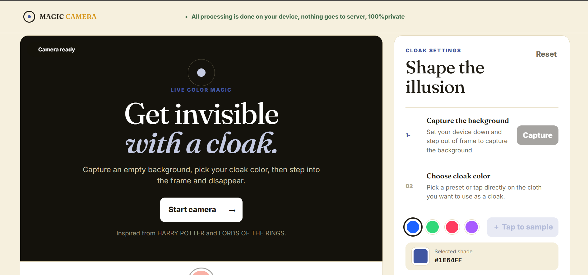
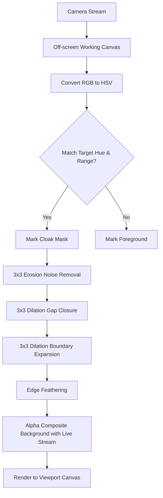

# Magic Camera

Magic Camera is an in-browser invisibility cloak experiment powered by real-time computer vision. It records an empty reference view of your scene, detects a selected cloth color in your live camera feed, and replaces that colored region with the saved background in real time.

**Live demo:** https://magic-camera-five.vercel.app/

[](https://developer.mozilla.org/en-US/docs/Web/JavaScript)
[](https://developer.mozilla.org/en-US/docs/Web/API/Canvas_API)
[](https://web.dev/progressive-web-apps/)
[](LICENSE)



The project is built with plain HTML, CSS, and vanilla JavaScript. It has no frameworks, external libraries, accounts, tracking, or server-side video processing. All image segmentation runs locally in your browser at 30+ FPS.

## Features

- Real-time video processing on mobile, tablet, laptop, and desktop devices
- Blue, green, red, and purple preset detection modes
- Custom color sampling by tapping any fabric shade in the live preview
- 3-pass morphological noise removal (3×3 erosion and dual 3×3 dilation)
- Adjustable color tolerance and edge feathering for smooth boundary blending
- 3-second background capture countdown with 30-frame averaging
- Seamless front and rear camera switching with selfie mirroring
- In-app photo capture, local image download, and Web Share API support
- Offline support and PWA installation via Service Worker
- Real-time FPS telemetry counter
- 100% on-device processing with zero data uploads

## How the effect works

The effect processes every video frame through an optimized client-side pipeline:


```mermaid
flowchart TD
    A["Camera Stream"] --> B["Off-screen Working Canvas"]
    B --> C["Convert RGB to HSV"]
    C --> D{"Match Target Hue & Range?"}
    D -- "Yes" --> E["Mark Cloak Mask"]
    D -- "No" --> F["Mark Foreground"]
    E --> G["3x3 Erosion Noise Removal"]
    G --> H["3x3 Dilation Gap Closure"]
    H --> I["3x3 Dilation Boundary Expansion"]
    I --> J["Edge Feathering"]
    J --> K["Alpha Composite Background with Live Stream"]
    K --> L["Render to Viewport Canvas"]
```

### Color detection logic

Every pixel is converted from RGB to the HSV (Hue, Saturation, Value) color space. Hue is represented as degrees on a 360° circle, allowing seamless wrap-around calculation:

$$\text{Hue Distance} = \min\big(|H - H_{\text{target}}|, \; 360^\circ - |H - H_{\text{target}}|\big)$$

A pixel belongs to the cloak mask when:
- $\text{Hue Distance} \le \text{tolerance}$ (user-adjustable between 20° and 60°)
- $\text{Saturation} \ge 0.314$ (filters out whites, grays, and blacks)
- $\text{Brightness} \ge 0.314$ (filters out deep shadows)

## Quick start

Camera access requires a secure context (`localhost` or HTTPS). Run the project locally using any static web server:

### Using Python

```bash
git clone https://github.com/ranaumarbilal31/Magic-Camera.git
cd Magic-Camera
python -m http.server 8000 --directory dist
```
Open `http://localhost:8000` in your browser.

### Using Node.js

```bash
npx serve dist
```

### Using VS Code

1. Open the project folder in Visual Studio Code.
2. Install the **Live Server** extension.
3. Right-click `dist/index.html` and select **Open with Live Server**.

## Getting the best result

- **Fabric:** Use a saturated, solid-colored cloth (matte royal blue or chroma green work best). Avoid shiny, reflective, or patterned fabrics.
- **Lighting:** Use even, diffused front lighting. Avoid harsh shadows or direct sunlight.
- **Stability:** Keep the device on a steady surface or tripod. The camera must not move after capturing the background.
- **Clothing:** Do not wear clothes that match the color of your cloak.
- **Tuning:** 
  - If unrelated objects or clothing disappear, decrease the **Color range** slider.
  - If parts of the cloth remain visible, increase the **Color range** slider.
  - If the edges of the cloak look jagged, increase the **Edge softness** slider.

## Controls

| Control | Action |
| :--- | :--- |
| **Start camera** | Requests permissions and starts the camera stream |
| **Capture background** | Initiates 3-second countdown and grabs clean background frames |
| **Retake background** | Clears the current background and allows recapturing the empty scene |
| **Color swatches** | Selects blue (220°), green (120°), red (0°), or purple (280°) detection |
| **Tap to sample** | Eyedropper mode to select any custom fabric shade from the live preview |
| **Color range** | Adjusts hue acceptance threshold around the selected shade |
| **Edge softness** | Softens and feathers mask boundaries |
| **Switch camera** | Toggles between available front and rear cameras |
| **Fullscreen** | Expands camera view to fill the screen |
| **Reset** | Restores default blue cloak settings |

## Project structure

```text
Magic-Camera/
├── dist/
│   ├── index.html            # Application markup and interface
│   ├── styles.css            # Responsive layout and styling
│   ├── app.js                # Image processing engine and camera controller
│   ├── manifest.webmanifest  # Progressive Web App manifest
│   ├── sw.js                 # Service worker for offline caching
│   ├── favicon.png           # Application icon
│   ├── icon.svg              # Vector icon
│   └── _headers              # Security and caching headers
├── pictures/
│   └── home.png              # Application preview screenshot
├── tests/
│   └── camera-flow.cjs       # Playwright end-to-end regression test
├── LICENSE                   # MIT License
└── README.md                 # Project documentation
```

## Performance

To maintain 30+ FPS across mobile devices and laptops without external libraries:
- **Internal Resolution Scaling:** Frames are processed on an internal canvas scaled to 320–400px width, while CSS handles display upscaling.
- **Typed Arrays:** Morphological filters operate on flat `Uint8Array` buffers to prevent garbage collection pauses.
- **Single-Loop Conversion:** RGB to HSV conversion is computed in a single pass over pixel data.

## Automated testing

With Node.js and Playwright installed:

```bash
node tests/camera-flow.cjs
```

The test suite creates a synthetic camera stream and verifies background calibration, countdown behavior, HSV mask creation, photo export, and UI states without needing a physical webcam.

## Privacy

Camera streams and captured images are processed entirely within the local browser memory. No video, photos, or analytics are ever transmitted to an external server or third-party service.

## License

This project is licensed under the [MIT License](LICENSE).

## Author

Created by [Bilal Rana (ranaumarbilal31)](https://github.com/ranaumarbilal31).
