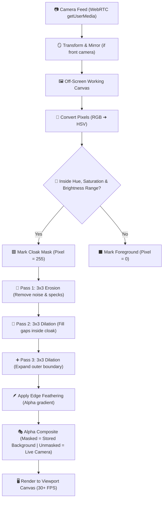

<div align="center">

# ✨ Magic Camera

### Turn any colored cloth into an invisibility cloak — live, private, and in your browser.

[](https://magic-camera-five.vercel.app/)
[](LICENSE)
[](https://developer.mozilla.org/en-US/docs/Web/JavaScript)
[](https://developer.mozilla.org/en-US/docs/Web/API/Canvas_API)
[](https://web.dev/progressive-web-apps/)
[](https://github.com/ranaumarbilal31/Magic-Camera#-privacy--security-guarantee)
[](https://github.com/ranaumarbilal31/Magic-Camera)

<br />

<a href="https://magic-camera-five.vercel.app/">
  
</a>

<br />
<br />

**[🚀 Launch Live Web App](https://magic-camera-five.vercel.app/)** • **[📖 Quick Start](#-quick-start)** • **[🧠 How It Works](#-how-the-magic-works)** • **[💡 Pro Tips](#-tips-for-the-best-invisibility-effect)** • **[🏷️ Repo Topics](#-repository-metadata--tags)**

</div>

---

## 📖 Overview

**Magic Camera** brings the legendary Harry Potter invisibility cloak illusion directly to the web!

Using real-time computer vision right inside your browser, the app:
1. Calibrates by capturing the empty scene background.
2. Identifies a chosen cloth color (via HSV chroma-keying) in your live camera feed.
3. Dynamically masks out the cloth with sub-pixel morphological smoothing.
4. Seamlessly composites the saved background in place of the cloth.

Whatever is hidden behind the cloth simply **vanishes**! 

### Why Magic Camera?
- **Zero Bloat & Zero Dependencies**: Unlike OpenCV.js or heavy WebAssembly bundles (~10MB+), Magic Camera implements an ultra-fast, customized computer vision pipeline in pure vanilla JavaScript (~23KB total).
- **100% Private & Client-Side**: No video frames ever leave your device. All image segmentation is calculated locally in RAM.
- **Works Everywhere**: Fully responsive on desktop, laptops, tablets, and smartphones (iOS & Android).
- **PWA & Offline Capable**: Install it as a standalone native-like app on your device and use it without an internet connection.

---

## ✨ Features

| Feature | Description |
| :--- | :--- |
| ⚡ **Real-Time 30+ FPS Processing** | Lightweight pixel manipulation pipeline optimized for mobile and desktop browsers. |
| 🎨 **4 Preset Cloak Shades** | Instant detection profiles for **Blue**, **Green**, **Red**, and **Purple** fabrics. |
| 🎯 **Tap-to-Sample Eyedropper** | Sample any unique cloth shade directly from the live preview for exact matching. |
| 🧹 **3-Pass Morphological Filter** | 3×3 Erosion eliminates stray pixel noise; dual 3×3 Dilation seals holes and expands cloak coverage. |
| 🪶 **Sub-Pixel Edge Feathering** | Soft alpha blending eliminates jagged green-screen borders and chromatic fringing. |
| ⏱️ **Hands-Free Countdown** | 3-second self-timer gives you time to step out of frame for clean background calibration. |
| 🔄 **Dual Camera Switching** | Effortlessly toggle between front (with automatic selfie mirroring) and rear cameras. |
| 📸 **In-App Photo Studio** | Snap pictures with one click, inspect the full-resolution result, download PNGs, or share via native Web Share API. |
| 📱 **PWA & Offline Shell** | Pre-cached progressive web app shell that works completely offline. |
| 🔒 **Absolute Privacy** | No cloud servers, no database, no analytics, no cookies, no tracking scripts. |
| 📊 **Live FPS Telemetry** | Built-in HUD measuring real-time frames-per-second performance. |

---

## 🧠 How the Magic Works

The invisibility effect runs on an optimized computer vision pipeline executed inside `requestAnimationFrame`:


```mermaid
flowchart TD
    A["📷 Camera Feed (WebRTC getUserMedia)"] --> B["🪞 Transform & Mirror (if front camera)"]
    B --> C["🖼️ Off-Screen Working Canvas"]
    C --> D["🎨 Convert Pixels (RGB ➔ HSV)"]
    D --> E{"📐 Inside Hue, Saturation & Brightness Range?"}
    E -- "Yes" --> F["🟩 Mark Cloak Mask (Pixel = 255)"]
    E -- "No" --> G["⬛ Mark Foreground (Pixel = 0)"]
    F --> H["🧹 Pass 1: 3x3 Erosion (Remove noise & specks)"]
    H --> I["🔄 Pass 2: 3x3 Dilation (Fill gaps inside cloak)"]
    I --> J["➕ Pass 3: 3x3 Dilation (Expand outer boundary)"]
    J --> K["🪶 Apply Edge Feathering (Alpha gradient)"]
    K --> L["🎭 Alpha Composite (Masked = Stored Background | Unmasked = Live Camera)"]
    L --> M["🖥️ Render to Viewport Canvas (30+ FPS)"]
```

### 🔬 The Color Detection Math

In standard OpenCV, the Hue channel is compressed to `0–180`. Magic Camera calculates full 360° circular hue coordinates in pure JavaScript:

$$\text{Hue Distance} = \min\big(|H - H_{\text{target}}|, \; 360^\circ - |H - H_{\text{target}}|\big)$$

A pixel is identified as part of the cloak if:
- $\text{Hue Distance} \le \text{tolerance}$ (customizable between 20° and 60°)
- $\text{Saturation} \ge 0.314$ (filters out dull grays, whites, and blacks)
- $\text{Brightness} \ge 0.314$ (filters out dark shadows and underexposed areas)

---

## 🚀 Quick Start

Magic Camera runs on any modern web browser. Because the browser requires a secure context (HTTPS or `localhost`) to access camera hardware, serve the project through a local static web server.

### Option 1: Python (Recommended — No Install Required)

```bash
# Clone the repository
git clone https://github.com/ranaumarbilal31/Magic-Camera.git
cd Magic-Camera

# Start a local web server
python -m http.server 8000 --directory dist

# On systems using python3:
# python3 -m http.server 8000 --directory dist
```
👉 Open **`http://localhost:8000`** in your browser.

---

### Option 2: Node.js (`npx serve`)

```bash
# Inside the project root:
npx serve dist
```
👉 Open the local URL printed in your terminal (usually `http://localhost:3000`).

---

### Option 3: VS Code (Live Server)

1. Open the project folder in **Visual Studio Code**.
2. Install the **Live Server** extension (by Ritwick Dey).
3. Right-click [`dist/index.html`](dist/index.html) and select **Open with Live Server**.

---

### Option 4: Deploy to Vercel / Netlify / GitHub Pages

Magic Camera is 100% static! Deploy it instantly with zero build configuration:
- **Root Directory**: `dist` (or deploy root pointing to `dist`)
- **Build Command**: None (leave empty)
- **Output Directory**: `dist` (or `.` if root is `dist`)

---

## 🎮 How to Use Magic Camera

```text
[ 1. Start Camera ] ➔ [ 2. Capture Empty Scene ] ➔ [ 3. Step In with Cloth ] ➔ [ 4. Snap & Share ]
```

1. **Mount your device**: Place your phone or computer on a steady desk or tripod so it doesn't move.
2. **Start camera**: Click **Start camera** and grant camera permissions.
3. **Capture background**:
   - Click **Capture background**.
   - Step completely out of view during the 3-second countdown.
   - The app averages 30 clean frames to create a crisp background snapshot. Wait for **"Cloak ready"**.
4. **Hold up your cloak**:
   - Step back into frame holding a solid-colored blanket, towel, or cloth.
   - Choose a preset (**Blue**, **Green**, **Red**, **Purple**) or click **Tap to sample** and tap your cloth on the screen.
5. **Adjust & Fine-tune**:
   - Open **Advanced settings** to adjust **Color range** (tolerance) or **Edge softness** (feathering).
6. **Take photos**: Click **Take photo** to review, download, or share your magical invisible picture!

---

## 💡 Tips for the Best Invisibility Effect

To achieve a convincing optical illusion, keep these optical factors in mind:

- 🟢 **Fabric Selection**: Use a deeply saturated, matte (non-shiny) cloth. Solid royal blue or chroma green fabrics work best. Avoid fabrics with patterns, embroidery, or metallic sheen.
- 💡 **Lighting**: Use bright, diffused, and even ambient light. Avoid harsh backlights, direct sunbeams, or strong directional spotlights that cast dark shadows onto the cloth.
- 🪑 **Rock-Solid Camera**: Keep the camera completely still. Any shift in camera angle or zoom will cause the background to misalign.
- 👔 **Wardrobe Contrast**: Do not wear clothing that matches your cloak color (e.g., don't wear blue jeans if using a blue cloak, unless you want your legs to disappear too!).
- 🎛️ **Tolerance Tuning**:
  - *If parts of the background or your body mistakenly disappear*: **Decrease** the **Color range** slider.
  - *If spots on the cloth remain visible*: **Increase** the **Color range** slider.

---

## 🎛️ Controls & Settings Reference

| Control | Description |
| :--- | :--- |
| **Start camera** | Requests browser camera permissions and opens video stream. |
| **Capture background** | Initiates 3-second countdown and grabs 30 background reference frames. |
| **Retake background** | Resets and recalibrates a fresh background if lighting or furniture shifts. |
| **Color Presets** | Instant switcher for common chroma hues: Blue (220°), Green (120°), Red (0°), Purple (280°). |
| **Tap to sample** | Activates the eyedropper tool to calibrate custom fabric shades. |
| **Color range (20–60)** | Controls hue acceptance threshold ($\pm\Delta\theta$ around target shade). |
| **Edge softness (0–5)** | Blurs and feathers mask contours to prevent hard pixel steps. |
| **Switch camera (↻)** | Cycles between available user-facing and environment-facing cameras. |
| **Fullscreen (⛶)** | Toggles full-viewport immersion mode. |
| **Reset** | Restores default settings and calibration values. |

---

## 📂 Project Structure

```text
Magic-Camera/
├── dist/
│   ├── index.html            # Main studio interface, control panels, dialogs
│   ├── styles.css            # Responsive layout, dark UI theme, animations
│   ├── app.js                # Computer vision engine, HSV processing, camera state
│   ├── manifest.webmanifest  # Progressive Web App (PWA) manifest definition
│   ├── sw.js                 # Service worker providing full offline caching
│   ├── favicon.png           # High-resolution application favicon
│   ├── icon.svg              # Scalable app vector logo
│   └── _headers              # Security & permission policy response headers
├── pictures/
│   └── home.png              # High-resolution application preview screenshot
├── tests/
│   └── camera-flow.cjs       # Playwright end-to-end synthetic camera test suite
├── LICENSE                   # MIT Open Source License
└── README.md                 # Complete documentation & project guide
```

---

## ⚡ Performance Engineering

Magic Camera achieves high frame rates across lower-end hardware without external dependencies:

- **Internal Scaled Resolution Buffer**: Processing full 1080p/720p streams pixel-by-pixel in JavaScript is CPU intensive. The engine downsamples frame manipulation to an internal optimal buffer (320px–400px width) and utilizes hardware-accelerated CSS scaling for the viewport canvas, yielding silky 30–60 FPS.
- **Fast TypedArrays**: Mask arrays use pre-allocated `Uint8Array` linear memory buffers to avoid garbage collection pauses during morphological operations.
- **Single-Loop Conversion**: Hue, saturation, and lightness are extracted in a single pass over the canvas `ImageData.data` buffer.
- **Batched Canvas Operations**: Background caching and soft-mask feathering use native 2D Canvas compositing (`globalCompositeOperation = 'destination-out'`) rather than secondary CPU blur passes.

---

## 🧪 Automated Testing

An automated headless regression test using synthetic camera feeds is included:

```bash
# Install Playwright (if not already installed)
npm install playwright

# Run the camera flow test
node tests/camera-flow.cjs

# To test with Google Chrome instead of Microsoft Edge:
# TEST_BROWSER=chrome node tests/camera-flow.cjs
```

The test validates camera initialization, countdown locking, background frame acquisition, HSV mask synthesis, photo capture pixel integrity, download triggers, and responsive layout behavior.

---

## 🌐 Browser Support

| Browser | Desktop | Mobile (Android / iOS) | Notes |
| :---: | :---: | :---: | :--- |
| **Google Chrome** | ✅ Supported | ✅ Supported | Full PWA installation & hardware acceleration |
| **Microsoft Edge** | ✅ Supported | ✅ Supported | Full PWA installation & hardware acceleration |
| **Mozilla Firefox** | ✅ Supported | ✅ Supported | Full camera & canvas support |
| **Apple Safari** | ✅ Supported | ✅ Supported | Supports iOS 14.3+ WebRTC camera permissions |
| **Samsung Internet**| — | ✅ Supported | Full PWA installation support |

> **Note**: iOS Safari requires HTTPS when accessed over the network to allow `navigator.mediaDevices.getUserMedia` access.

---

## 🔒 Privacy & Security Guarantee

Magic Camera is built with a **strict privacy-first philosophy**:

- 🛡️ **Zero Remote Transmission**: Video streams, canvas buffers, and camera snapshots stay 100% inside your device's browser memory.
- 🚫 **No Tracking or Analytics**: No Google Analytics, no Meta Pixels, no telemetry, no tracking cookies.
- 💾 **No Database or Cloud Storage**: No images or data are ever saved to a cloud server or external database.
- 🗑️ **Ephemeral Session**: Closing or refreshing the page immediately purges the background buffer and temporary photos from memory.
- 📤 **User-Initiated Sharing Only**: Photos leave the browser only if you explicitly choose the "Download" or "Share" buttons.

---

## 🏷️ Repository Metadata & Tags

Copy and paste these directly into your GitHub repository details:

### 📌 Repository Description
```text
🧙‍♂️✨ Real-time Harry Potter-style invisibility cloak in your browser. Pure JavaScript & HTML5 Canvas with HSV chroma-keying. 100% private & client-side.
```

### 🏷️ GitHub Topics (Tags)
```text
invisibility-cloak, computer-vision, javascript, html5-canvas, chroma-key, hsv-color-space, image-processing, webrtc, pwa, camera, privacy-first, creative-coding, augmented-reality, vanilla-javascript, opencv-alternative, real-time, web-app, zero-dependencies, photo-capture, browser-experiment
```

### 📱 Social Media Hashtags
```text
#JavaScript #WebDev #ComputerVision #CreativeCoding #HTML5Canvas #PWA #OpenSource #InvisibilityCloak #VanillaJS #WebRTC #ChromaKey #HarryPotter #TechDemo #BuildInPublic
```

---

## 🤝 Contributing

Contributions, bug reports, and feature suggestions are welcome!

1. Fork the Project (`https://github.com/ranaumarbilal31/Magic-Camera/fork`)
2. Create your Feature Branch (`git checkout -b feature/AmazingFeature`)
3. Commit your Changes (`git commit -m 'Add some AmazingFeature'`)
4. Push to the Branch (`git push origin feature/AmazingFeature`)
5. Open a Pull Request

---

## 📄 License

Distributed under the **MIT License**. See [`LICENSE`](LICENSE) for more information.

---

## 👤 Author

Crafted with magic by **[Bilal Rana (ranaumarbilal31)](https://github.com/ranaumarbilal31)**.

⭐ If you enjoyed this project, give it a star on [GitHub](https://github.com/ranaumarbilal31/Magic-Camera)!
